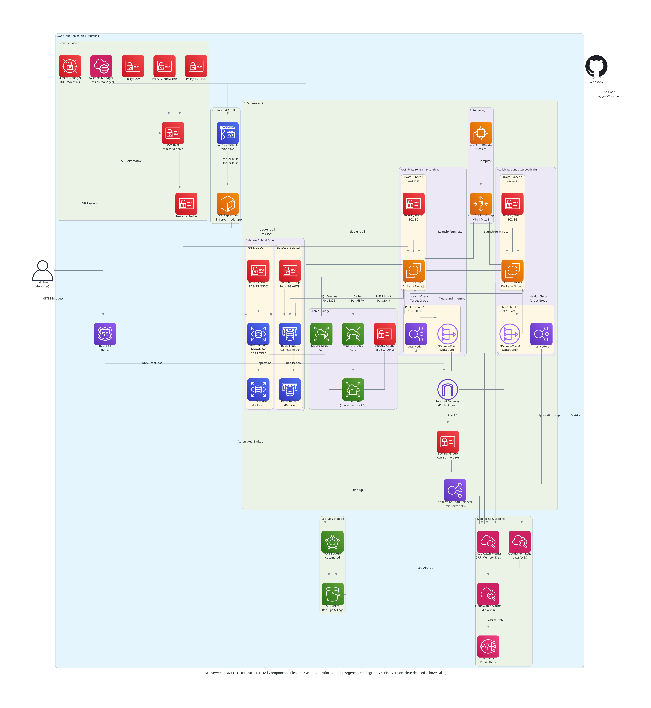
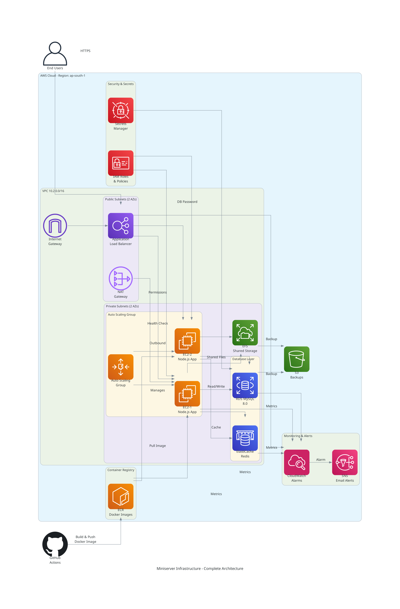

# Miniserver Infrastructure (Terraform + AWS)

Production-style Terraform project for deploying a multi-tier application stack on AWS, including networking, compute, load balancing, autoscaling, data services, storage, monitoring, and container image registry.

## Architecture Diagram



Alternate diagram (lighter view):



## Project Structure

```text
.
├── main.tf                      # Root module wiring
├── variable.tf                  # Root input variables
├── output.tf                    # Root outputs
├── localfile.tf                 # Local text report files
├── module/
│   ├── network/                 # VPC, subnets, routing, NAT
│   ├── loadbalancer/            # ALB, target group, listener
│   ├── compute/                 # EC2, IAM profile, app SG
│   ├── autoscaling/             # Launch template + ASG
│   ├── database/                # RDS + Redis + Secrets Manager
│   ├── storage/                 # EFS + mount targets
│   ├── monitoring/              # CloudWatch alarms + dashboard + SNS
│   ├── ecr/                     # ECR repo + lifecycle policy
│   └── docker/                  # Node.js sample app + Dockerfile
└── .github/workflows/
    ├── terraform.yml            # Validate/plan/cost/apply pipeline
    ├── terraform-destroy.yml    # Guarded manual destroy
    └── docker-build.yml         # Build/push Docker image to ECR
```

## Module Overview

- `network`: Creates VPC, public/private subnets across AZs, IGW, route tables, NAT resources.
- `loadbalancer`: Creates internet-facing ALB, ALB security group, listener, and target group.
- `compute`: Provisions EC2 app instances, instance profile/role, and app security group.
- `autoscaling`: Creates launch template + autoscaling group and attaches to ALB target group.
- `database`: Creates MySQL RDS, Redis ElastiCache, and stores DB credentials in Secrets Manager.
- `storage`: Creates EFS file system, access point, and mount targets in private subnets.
- `monitoring`: Creates CloudWatch alarms and dashboard, sends alerts to SNS email subscription.
- `ecr`: Creates ECR repository and lifecycle policy for container image retention.

## Root Deployment Flow

`main.tf` wires modules in this order:

1. `network`
2. `loadbalancer` (depends on network)
3. `storage` (depends on network)
4. `compute` (depends on network + loadbalancer + storage)
5. `autoscaling` (depends on compute + network + loadbalancer)
6. `database` (depends on network)
7. `monitoring` (depends on autoscaling + loadbalancer + database)
8. `ecr`

## Prerequisites

- Terraform installed
- AWS credentials configured (`AWS_ACCESS_KEY_ID`, `AWS_SECRET_ACCESS_KEY`, region access)
- Terraform Cloud access for backend workspace:
  - Organization: `RajBuild`
  - Workspace: `Terraform_cli`

## Root Variables

Defined in `variable.tf`:

- `environment` (default: `prod`)
- `vpc_cidr` (default: `10.2.0.0/16`)
- `instance_count` (default: `2`, validation max `2`)

## How to Deploy

```bash
terraform init
terraform fmt --recursive
terraform validate
terraform plan -out=tfplan
terraform apply tfplan
```

## CI/CD Workflows

### Terraform Pipeline (`.github/workflows/terraform.yml`)

- Triggered on `push` and `pull_request` to `main`
- Runs `init`, `fmt`, `validate`, `plan`
- Runs Infracost cost check
- Auto-applies on push to `main`

### Terraform Destroy (`.github/workflows/terraform-destroy.yml`)

- Manual trigger only
- Requires `confirm_destroy == DESTROY`
- Uses separate prepare + apply stages

### Docker Build + Push (`.github/workflows/docker-build.yml`)

- Triggered on:
  - push to `main`/`master` with changes under `module/docker/**`
  - manual dispatch
- Job actually runs only when:
  - push commit message contains `[build-image]`, or
  - manual input `confirm_build == BUILD`
- Builds from `module/docker` and pushes to ECR repo `miniserver-node-app` with:
  - `${{ github.sha }}`
  - `latest`

## Outputs and Local Artifacts

- Terraform outputs are defined in `output.tf`
- `localfile.tf` writes local summary files (VPC, subnet, compute, deployment metadata)

## Notes

- `module/assignment-3/` is intentionally ignored in git.
- Docker source app now lives under `module/docker/`.
